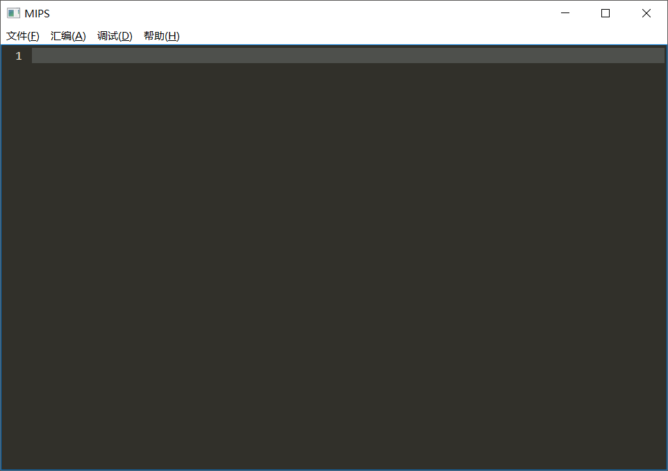
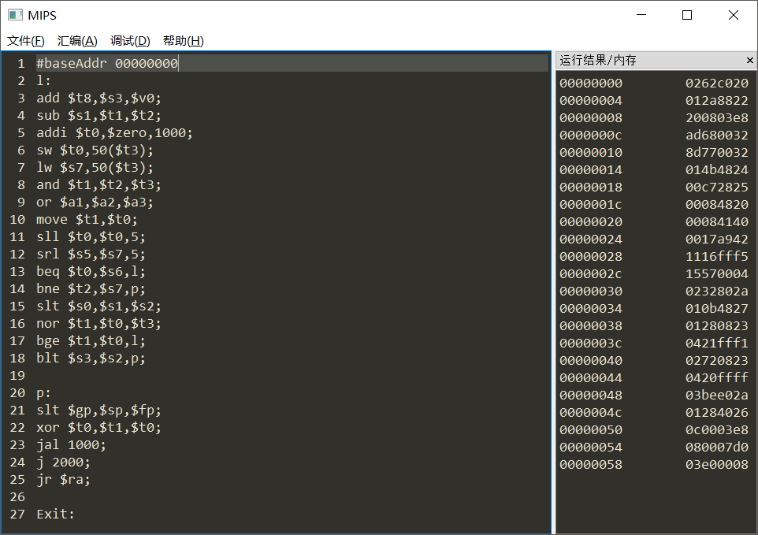
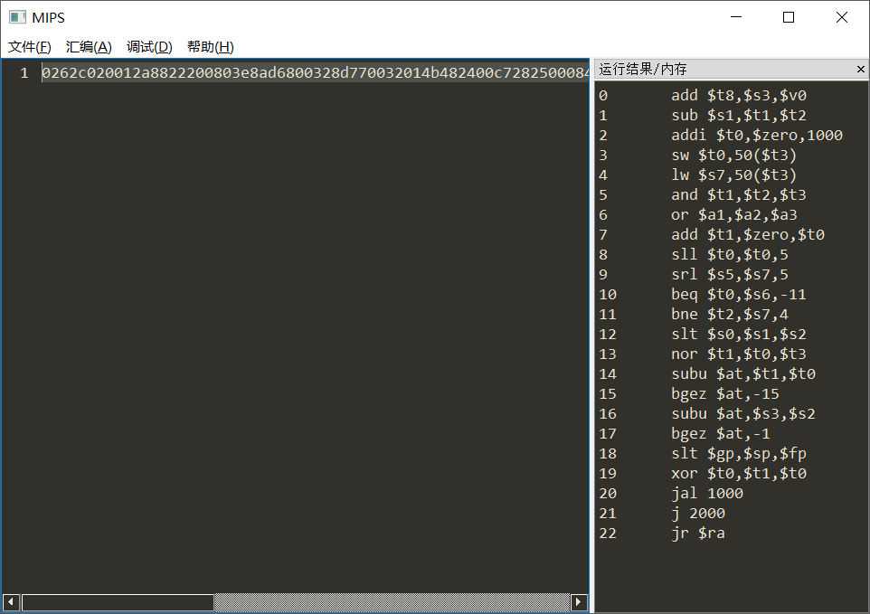
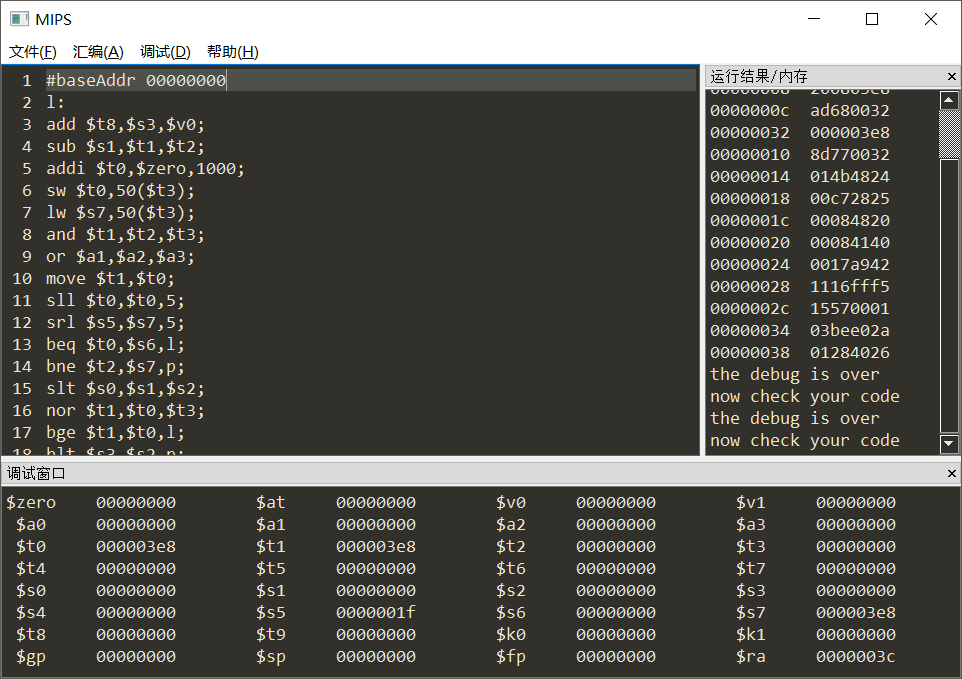

# MIPS汇编器

*Made by Aaron*

---
- **主要功能**：MIPS汇编器，反汇编器，调试模式
- **平台要求**：Python3 + pyQT5
- **文件格式**：十六进制及二进制文件(*.coe *.bin)，汇编文件(*.asm)
- **代码运行**: `python ./src/MIPS.py `
- **测试数据**：`./test/test.coe test.asm`

---
- **功能展示**：
1. 主界面
   
2. 汇编器
   
3. 反汇编器
   
4. 调试模式
   

---
**具体细节请参见实验报告**

---
